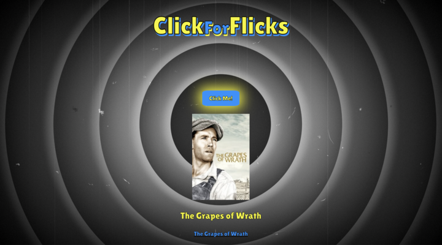

# ClickForFlicks
*Randomly generating flicks for you to watch when you don't know what you want!*

## Collaborators
* GUI: [Andrea Ginn](https://github.com/andreaginn)
* Developement: [Wendy Vu](https://github.com/chewytaro) <3
* Presentation: [Alfredo Rodriguez](https://github.com/AlfredRodr)
* UX: [MC Bariekman](https://github.com/mcbariekman)

## APIs used
* [IMDb](https://imdb-api.com/api)
* [Watchmode](https://api.watchmode.com/)

## CSS Frameworks
* [Foundation](https://get.foundation/index.html)
* [Google Fonts](https://developers.google.com/fonts/docs/developer_api#APIKey)
* [Font Awesome](https://fontawesome.com/)

## Usage

